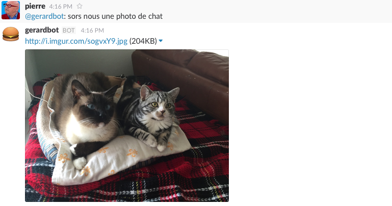
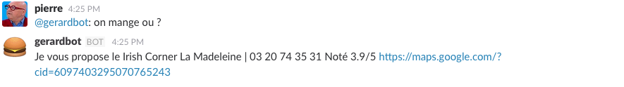

**GérardBot!**
===================

Hey! This is a very simple Slack bot based on the excellent [slackbots](https://www.npmjs.com/package/slackbots "slackbots") library allowing you to easily add your own services.

----------

Installation
-------------
1. Download and install the latest Node.js version
2. Clone the repository **git clone git@github.com:Karhal/gerardbot.git**
3. Enter the repository cd ~/gerardbot
4. Install: npm install

#### <i class="icon-file"></i> Configuration
You'll need a Slack token (https://my.slack.com/services/new/bot) and a bot name. Please check the config.example.js file.

#### <i class="icon-file"></i> Create a module

The real advantage of Gérardbot is that you can easily create your own modules which will be plugged to you original bot. 
Let's create a simple HelloWorld module as an example :

    

lib/modules/helloworld/helloworld.js

    
    var util = require('util');
    var config = require('./config.js');
    var Module = require('./../../../bin/module.js');
    
    var Helloworld = function Constructor(bot) {
        this.bot = bot;
        this.data = null;
        this.keyWords = config.keywords;
    };
    util.inherits(Helloworld, Module);
    
    Helloworld.prototype.getAnswer = function() {
          this.bot.postMessage(this.data.channel, 'Hello world!', this.bot.params);
    };

----------
   lib/modules/helloworld/config.js
    
    var config = {};   
    config.keywords = ['hello', 'bonjour'];   
    module.exports = config;

#### That's it !

Usage
-------------
1. Run your application : node bin/bot.js
2. Connect to your slack
3. Invite your bot in the channel you want: /invite @yourbot
4. Say @yourbot hello ! 
5. Enjoy

Imgur Module example
-------------
lib/modules/imgur/config.js

    var config = {};

    config.keywords = ['montre moi des', 'sors nous une photo de'];
    config.imgurAuth = 'Client-ID xxxxxxxxxxx';

    config.subs = {
        'chiens': 'dogs',
        'chat': 'cats',
        'paresseux': 'sloths',
    }

    module.exports = config;

Restaurant Module example
-------------
lib/modules/restaurant/config.js

    var config = {};

    config.myplace = '50.654809,3.071461';
    config.googlemaps_api_key = 'xxxxxxxxxxxxxxx';
    config.radius = 1000;
    config.keywords = ['on mange ou', 'on mange où'];
    module.exports = config;

